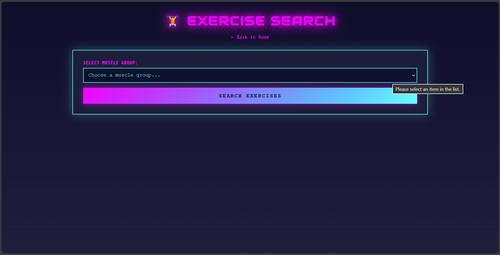
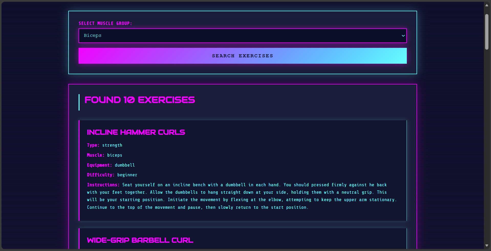
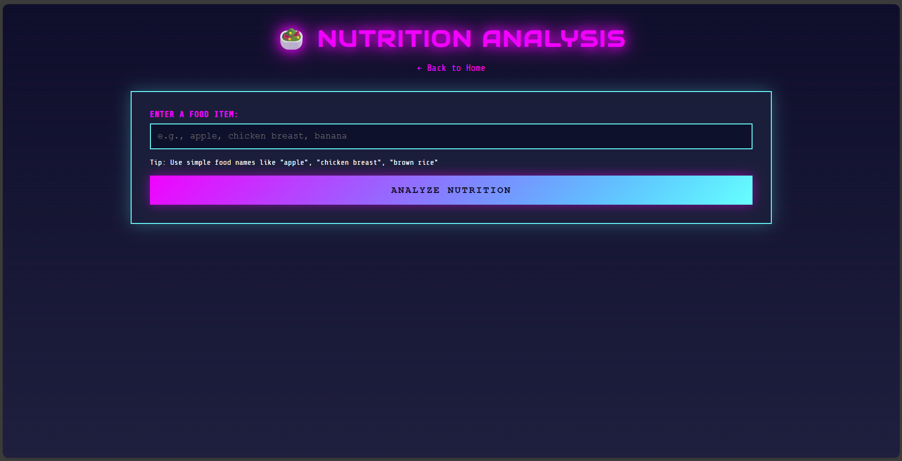
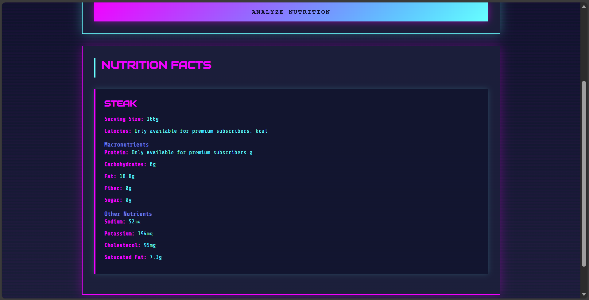
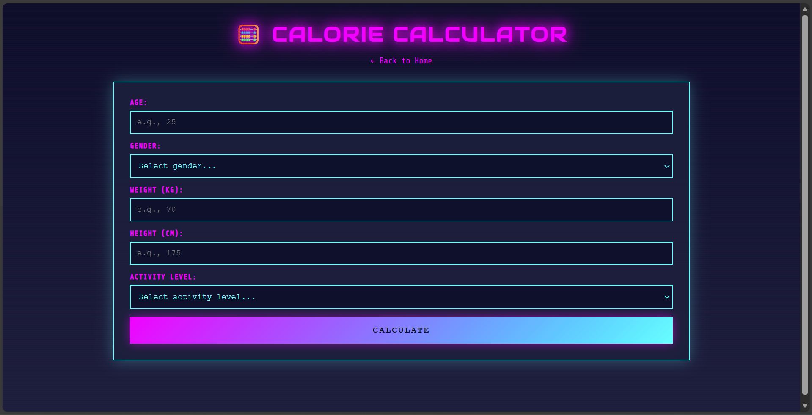
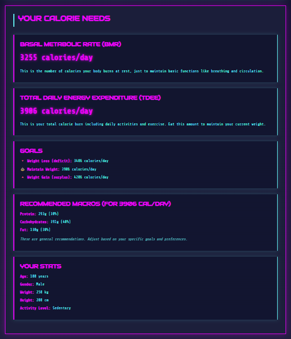
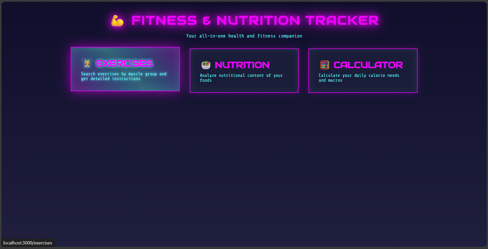

# 🏋️ FitCat - Fitness & Nutrition Tracker

A full-stack web application designed to help fitness enthusiasts track their workouts, analyze nutrition, and calculate personalized calorie needs. Built with Node.js, Express, and a cyberpunk-themed UI.

## ✨ Features

### 🔍 Exercise Search
Search exercises by muscle group and get detailed instructions, equipment needed, and difficulty levels.




### 🍎 Nutrition Analysis
Analyze any food item to get comprehensive nutritional information including calories, macros, and micronutrients.




### 🧮 Calorie Calculator
Calculate your BMR (Basal Metabolic Rate), TDEE (Total Daily Energy Expenditure), and get personalized macro recommendations based on your goals.




## 🎨 UI Design

Cyberpunk-themed interface with neon aesthetics and smooth animations.



## 🛠️ Technologies Used

- **Backend**: Node.js, Express.js
- **Frontend**: EJS templating, CSS3 (custom cyberpunk theme)
- **APIs**: [API Ninjas](https://api-ninjas.com/) (Exercise & Nutrition endpoints)
- **HTTP Client**: Axios
- **Environment Variables**: dotenv

## 🚀 Installation & Setup

1. **Clone the repository**
```bash
   git clone https://github.com/KaterynaGurina/fitCat.git
   cd fitCat
```

2. **Install dependencies**
```bash
   npm install
```

3. **Set up environment variables**
   
   Create a `.env` file in the root directory:
```env
   PORT=3000
   EXERCISE_API_KEY=your_api_ninjas_key_here
```
   
   Get your free API key from [API Ninjas](https://api-ninjas.com/)

4. **Run the application**
```bash
   node index.js
```

5. **Open in browser**
   
   Navigate to `http://localhost:3000`

## 📁 Project Structure
```
fitCat/
├── index.js              # Main server file
├── package.json          # Dependencies and scripts
├── .env                  # Environment variables (not tracked)
├── .gitignore           # Git ignore rules
├── README.md            # Project documentation
├── screenshots/         # UI screenshots
├── public/
│   └── styles/
│       └── main.css     # Cyberpunk theme styles
└── views/
    ├── index.ejs        # Homepage
    ├── exercises.ejs    # Exercise search page
    ├── nutrition.ejs    # Nutrition analysis page
    └── calculator.ejs   # Calorie calculator page
```

## 🔑 Features Breakdown

### Exercise Search
- Search by 16+ muscle groups (biceps, chest, abs, glutes, etc.)
- Returns up to 10 exercises per search
- Displays: exercise name, type, muscle, equipment, difficulty, instructions

### Nutrition Analysis
- Analyze any food item or meal
- Returns: calories, protein, carbs, fat, fiber, sugar
- Shows serving size and detailed micronutrients

### Calorie Calculator
- Calculates BMR using Mifflin-St Jeor equation
- Factors in activity level (sedentary to extra active)
- Provides:
  - Maintenance calories (TDEE)
  - Weight loss target (-500 cal)
  - Weight gain target (+300 cal)
  - Personalized macro split (30% protein, 40% carbs, 30% fat)

## 📊 API Reference

This project integrates with **API Ninjas**:

- **Exercise API**: `GET https://api.api-ninjas.com/v1/exercises`
- **Nutrition API**: `GET https://api.api-ninjas.com/v1/nutrition`

Both endpoints require an API key passed via `X-Api-Key` header.

## 🎯 Future Enhancements

- [ ] User authentication and profile storage
- [ ] Save favorite exercises and meals
- [ ] Weekly workout planner
- [ ] Progress tracking charts
- [ ] Mobile responsive improvements
- [ ] Dark/light theme toggle

## 👤 Author

**Kateryna Gurina**
- GitHub: [@KaterynaGurina](https://github.com/KaterynaGurina)
- LinkedIn: [Your LinkedIn Profile]

## 📄 License

This project is open source and available under the [MIT License](LICENSE).

## 🙏 Acknowledgments

- [API Ninjas](https://api-ninjas.com/) for providing free fitness and nutrition APIs
- Cyberpunk aesthetic inspiration from sci-fi and techno culture
- Built as a learning project for full-stack web development

---

⭐ If you found this project helpful, please consider giving it a star!